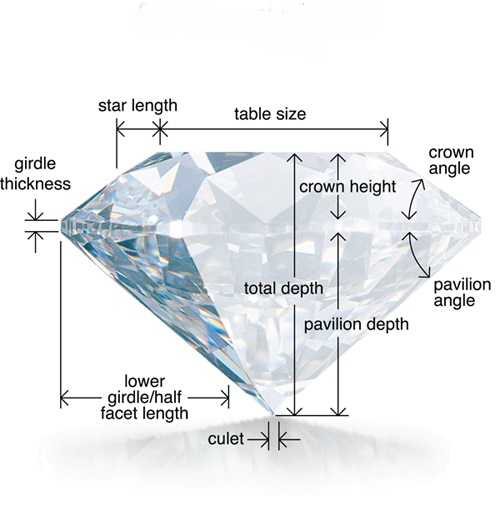
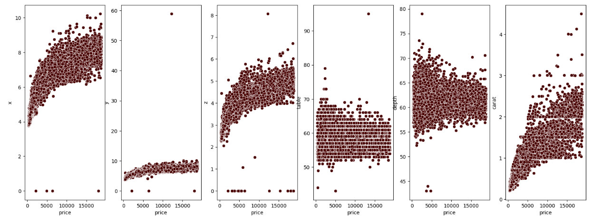

# Final project of module 3
Welcome to this project designed to predict the price of diamonds based on different features that describe them.
html

  

### 🎯 The project description
The objective of this project is to obtain the closest prediction to the real values, based on the given dataset. 

### 📑 Dataset
The dataset is downloaded from kaggle and consists of 3 files:
- A database with the normalized tables, where the information related to diamonds is found, where their features and corresponding prices are included. A total of 40485 diamonds are included. These data will be used to train the model.
- A '.csv' file where the diamonds for price prediction are included. A total of 13484 diamonds are included.

The features included in the dataset are:
Cut, color, clarity, city, carat, depth, table, x, y and z. In addition to the price in the case of data to be used for training.

### 🚀 Pipeline
The different phases that are carried out are described below: 
- Data extraction:
    - The normalized tables are extracted from the database using duckdb. A query is used to extract the information of the different diamonds from all the tables included in the database, to a single denormalized table to work with.
    - The test data is extracted from the '.csv' file.
    
- Data cleaning:
This dataset does not include 'NaN' values in any of the records, but you can observe records where the x, y or z features have a value of 0, and since they are dimensions this is an error. On the other hand, some duplicate records can also be found. To correct these errors the following tasks are performed:
    - Imputation of the records with value 0, with the median of the rest of the records.
    - Deleting duplicate records.

- Elimination of outliers:
There are some values of numerical features in which certain outliers can be observed and therefore these records are eliminated.

- Encoding:
Some of the features in the dataset are categorical and therefore need to be transformed into numerical values so that the machine learning models can work with these. Due to the models that will be used later, it will not be necessary to scale the data.

- Feature engineering:
Several features created have been tested but have not improved the model prediction. Therefore, only the shape feature is included. Table and depth are taken into account to categorize diamonds according to their shape. 

- Machine learning model train:
After several tests, the stacking method has been chosen to perform the price prediction with the training dataset. It has been decided to use this method since with the different algorithms separately I have not obtained a prediction or, on the contrary, it was possible to observe greater overfitting. 
Therefore, this method is intended to combine the strengths of different models using different algorithms with different parameters. In addition, it incorporates cross validation in model training and has the advantage that in addition to making a first prediction with the different models, in the prediction with the final estimator it takes into account the data and the previous prediction values.
    - The XGB Regressor, LGBM Regressor, Random Forest Regressor and MLP Regressor have been selected as estimators. Before training the stacking model, the GridSearch method was used to determine which are the best parameters for the stacking model. 
    - XGB Regressor has been used as the final estimator.

- To obtain the prediction:
Finally the prediction is obtained with the test dataset and saved in a '.csv' file with the indicated format.
    

### 💻 Technology stack
- Python==3.9.18
  - pandas==2.1.1
  - numpy==1.26.0
  - duckdb==0.9.3
  - seaborn==0.13.2
  - matplotlib==3.8.2
  - umap-learn==0.5.5
  - scikit-learn==1.4.0
  - xgboost==2.0.3
  - ligthgbm==4.3.0

### 📁 Folder structure
    ├── .gitignore
    ├── README.md
    ├── LICENSE
    ├── img
    ├── data
    |   ├── processed
    |   ├── submissions
    |   ├── test
    |   ├── train
    |   └── sample_submission.csv
    └── notebooks
    |   ├── other_notebooks
    |   ├── EDA.ipynb
        └── Pipeline.ipynb

### 👀Context
This is the final project of module 3 for the Ironhack Part Time Data Analytics Bootcamp. 

### 📨 Contact info
If you have some question, drop me a line! (sanchezvicentecarlos@gmail.com).
